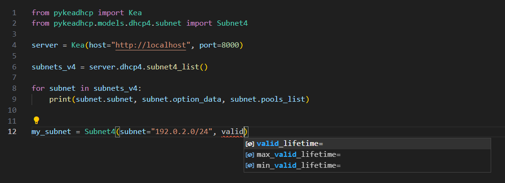
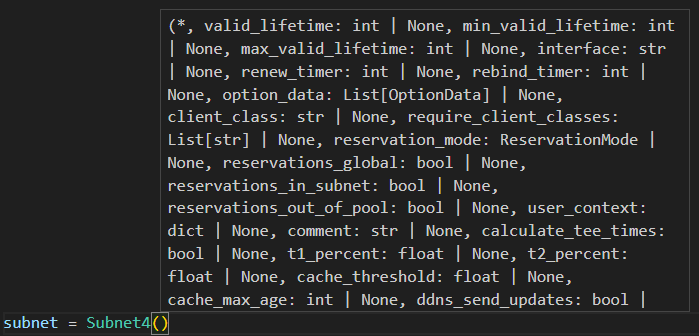

[](https://github.com/psf/black)
[](https://github.com/BSpendlove/pykeadhcp/actions/workflows/ci.yml/badge.svg)

# pykeadhcp
A python module used to interact with the Kea DHCP API daemons (dhcp4, dhcp6, ctrl-agent and ddns) with Pydantic support so your editor support should be pretty, and also provides basic data validation for any models implemented (eg. Subnet4).

## How to use

1. Install the module

```
pip install pykeadhcp
```

2. Import the Kea class

```python
from pykeadhcp import Kea

server = Kea(host="http://localhost", port=8000)
```

3. Call API commands based on the Daemon

```python

subnets_v4 = server.dhcp4.subnet4_list()

for subnet in subnets_v4:
    print(subnet.subnet, subnet.option_data, subnet.relay, subnet.pools_list)

my_subnet = server.dhcp6.subnet4_get(name="pykeadhcp-pytest")
print(my_subnet.json(exclude_none=True, indent=4))

# {
#     "valid_lifetime": 4000,
#     "renew_timer": 1000,
#     "rebind_timer": 2000,
#     "option_data": [],
#     "calculate_tee_times": true,
#     "t1_percent": 0.5,
#     "t2_percent": 0.8,
#     "store_extended_info": false,
#     "name": "pykeadhcp-pytest",
#     "relay": {
#         "ip-addresses": []
#     },
#     "subnet6": [
#         {
#             "valid_lifetime": 4000,
#             "renew_timer": 1000,
#             "rebind_timer": 2000,
#             "option_data": [],
#             "calculate_tee_times": true,
#             "t1_percent": 0.5,
#             "t2_percent": 0.8,
#             "store_extended_info": false,
#             "id": 40123,
#             "subnet": "2001:db8::/64",
#             "preferred_lifetime": 3600,
#             "pd_pools": [],
#             "rapid_commit": false
#         }
#     ],
#     "rapid_commit": false
# }
```

4. Utilize the Pydantic models which provide basic data validation

```python
from pykeadhcp.models.dhcp4.subnet import Subnet4

my_subnet = Subnet4(
    id=1234, subnet="192.0.2.32/31", option_data=[{"code": 3, "data": "192.0.2.32"}]
)

create_subnet = server.dhcp4.subnet4_add(subnets=[my_subnet])
print(create_subnet.result, create_subnet.text)

# Note because subnet_cmds hook library is not loaded, we run into an exception here:
# pykeadhcp.exceptions.KeaHookLibraryNotConfiguredException: Hook library 'subnet_cmds' is not configured for 'dhcp4' service. Please ensure this is enabled in the configuration for the 'dhcp4' daemon
```

The super handy feature with using Pydantic for all the data models is the fact it uses Python type annotation which most editors/IDEs should be able to provide autocomplete functionality like this:




### Basic Authentication

If you have basic authentication enabled on your Kea Servers, initialize the `Kea` class like this:

```python
from pykeadhcp import Kea

server = Kea(host="http://localhost", port=8000, use_basic_auth=True, username="your-username", password="your-password")
```

## Cached Config

Once you initialize the Kea class, it will automatically attempt to gather the configuration for all daemons and cache them locally as `cached_config` eg. like:

```
from pykeadhcp import Kea

server = Kea(host="http://localhost", port=8000)

# Control Agent
print(server.ctrlagent.cached_config)

# Dhcp4
print(server.dhcp4.cached_config)

# Dhcp6
print(server.dhcp6.cached_config)

# DDNS
print(server.ddns.cached_config)
```

If you make a change via the API that amends the configuration (eg. network4-add), the cached config must be refreshed manually using:

```
server.dhcp4.refresh_cached_config()
```

For API calls that don't amend the configuration (eg. lease4-add, lease6-add, config-get, etc....), there is no need to refresh the relevant daemon configuration. Maybe I will add a feature in the future to allow the user to specify if they want the cached_config to be automatically refreshed when a function is called that requires a refresh but for now its manual.

## API Reference

All supported commands by the daemons are in the format of the API referenced commands with the exception of replacing any hypthen or space with an underscore. Eg. the `build-report` API command for all daemons is implemented as `build_report` so it heavily ties into the Kea predefined commands when looking at their documentation. Currently everything is built towards Kea 2.2.0. Pydantic variables will replace any hyphens with an underscore however when loading/exporting the data models, it will replace all keys with the hyphen to adhere to the Kea expected variables, ensure that the `KeaBaseModel` (located in `from pykeadhcp.models.generic.base import KeaBaseModel` instead of `from pydantic import BaseModel`) is used when creating any Pydantic models to inherit this functionality.

## Development / Contribution

See [this document which explains the development/setup to contribute to this project](CONTRIBUTING.md)

## Commands Implemented/Tested

See [this document which shows what commands are implemented and tested in the latest release](COMMANDS.md)